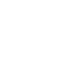
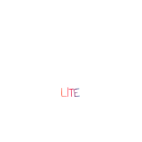

<h1 align="center">HEJMUA</h1>
<h3 align="center">JUNIOR FULL-STACK DEVELOPER </h3>

---

<h1 align="center">About me</h1>

I am a Junior Full-Stack Developer, a 2nd-year student at KASV, and a passionate creator of technological solutions. Currently, I am developing and maintaining my own ecosystem, Omega, which serves as my personal experiment in the world of technology and product development.

In addition, I actively create open-source projects to not only share knowledge with the community but also to enhance my skills, explore new technologies, and experiment with different approaches. My goal is continuous self-learning and self-improvement.

<h1 align="center">Tech Stack & Info</h1>

  <!-- Languages -->
  

    <h2 style="margin-bottom: 25px;">Languages</h2>
    <ul style="list-style: none; padding: 0;">
      <li style="margin-bottom: 20px;">
        

          🇺🇦
          <strong style="flex: 1; text-align: left;">Ukrainian</strong>
          C2
        

        

          

        

      </li>
      <li style="margin-bottom: 20px;">
        

          🇷🇺
          <strong style="flex: 1; text-align: left;">Russian</strong>
          C2
        

        

          

        

      </li>
      <li style="margin-bottom: 20px;">
        

          🇸🇰
          <strong style="flex: 1; text-align: left;">Slovak</strong>
          C1
        

        

          

        

      </li>
      <li style="margin-bottom: 20px;">
        

          🇺🇸
          <strong style="flex: 1; text-align: left;">English</strong>
          B2
        

        

          

        

      </li>
    </ul>
  

  <!-- Tech Stack -->
  

    <h2>Tech Stack</h2>
    

      
      
      
      
      
      
      
    

    

      
      
      
      
      
      
      
    

    

      
      
      
      
      
      
      
    

  

  <!-- Education -->
  

    <h2 style="margin-bottom: 25px;">Education</h2>
    <ul style="list-style: none; padding: 0; margin-top: 20px;">
      <li style="margin-bottom: 15px;">
        <strong>2022-2024</strong> TUKE - Computer Science
      </li>
      <li style="margin-bottom: 15px;">
        <strong>2024-present</strong> KASV - Computer Science
      </li>
    </ul>
  

---

<h1 align="center">Projects</h1>

###

    

    
    

---

<h1 style="text-align: center;">Omega Ecosystem</h1>

<strong>Omega Ecosystem</strong> is a comprehensive platform for centralized management of digital communities. It combines a variety of tools and solutions for efficient administration, process automation, and analytics, creating a unified space for productive teamwork and community management.

The projects within the Omega Ecosystem are independent products, each addressing specific needs:

<ul style="max-width:800px; margin: 0 auto 30px auto; padding:0; list-style: none; text-align:center;">
  <li style="margin-bottom: 15px;">
    <strong>Omega</strong> — a centralized system for managing large Discord communities. It unifies administration processes, analytics, team coordination, and member activity monitoring in a single convenient panel, minimizing fragmentation and chaos.
  </li>
  <li>
    <strong>Omega Lite</strong> — a Telegram bot designed for centralized channel management. It provides streamlined content management and automation of routine processes within a Telegram channel.
  </li>
</ul>

<strong>Omega Ecosystem</strong> is more than just a set of tools; it represents a unified philosophy for organizing digital communities: efficiency, control, and transparency in every project.

---

<h1 style="text-align:center;">OMEGA</h1>

<!-- Description -->

  <h2 style="margin-bottom: 25px;">Description</h2>
  

      The main goal of the Omega project is to create a unified centralized system for managing a large Discord community and all the teams operating within it. 
      The project addresses the problem of fragmented management, where some processes are handled in personal chats, others are recorded in Google Sheets, and statistics are often missing. 
      Omega brings together all key management elements into a single convenient dashboard, allowing teams to be coordinated, automating staff work, simplifying access to member information, and integrating artificial intelligence to support decision-making and handle routine tasks.
  

  

      The Omega project is built as a multi-layered system. The web application with a React frontend provides a convenient panel for managing users, teams, and statistics, as well as working with AI assistants. 
      The backend is based on a microservices architecture: the main server runs on Spring Boot, authentication via Discord OAuth2 is handled on Express.js. Bot integration through Discord.js allows direct community management, while Aiogram provides Telegram integration. 
      RabbitMQ is used for data processing, and the database is PostgreSQL.
  

  

      Key advantages of the Omega project include time savings through the automation of routine processes, convenience and transparency— all data about teams and participant activity is in one place, security through Discord OAuth2, and reliability thanks to containerization with Docker and deployment on Railway, ensuring uninterrupted 24/7 operation and easy scalability as the community grows.
  

  <!-- Tech Stack -->
  

    <h2>Tech Stack</h2>
    <!-- Frontend Stack -->
    

      
      
      
      
      
    

    <!-- Backend Stack -->
    

      
      
      
      
    

    <!-- Middleware & Messaging -->
    

      
      
    

    <!-- Database -->
    

      
      
    

    <!-- DevOps -->
    

      
      
      
    

    
  

---

<h1 style="text-align:center;">OMEGA LITE</h1>

<!-- Description -->

  <h2 style="margin-bottom: 25px;">Description</h2>
  

      The Omega Lite project is designed to unify the management of a Telegram channel, chat, and all associated bots in one place—directly through a bot chat. Many administrators currently rely on multiple fragmented tools for moderation, posting, and giveaways, which creates chaos and extra workload. Omega Lite simplifies administration, allowing you to monitor participant activity, automate routine tasks, and get a complete overview of what is happening in the channel.
  

  

      The bot enables centralized control over all channel and chat processes, automates moderation, publishing, and giveaways, tracks participant activity and team performance, and allows easy expansion of functionality with new commands and modules.
  

  

      Omega Lite is built as a single Telegram bot with modules for different tasks. Moderation is streamlined with warnings, bans, mutes, and automatic message filtering. Giveaways and contests are easy to run, with participant registration, random winner selection, and chat notifications. Post scheduling allows you to create content calendars, publish instantly, and attach media. Detailed statistics and analytics provide insights on participant activity, post effectiveness, and giveaway results. Asynchronous tasks handle background processes for events, timers, and notifications. All management is fully local—commands are executed directly in the bot chat, with no web panel required.
  

  

      The main advantages of Omega Lite include automation of routine processes, saving time and reducing errors, ease of use through the familiar Telegram interface, full control and transparency of team and participant activity in real time, flexibility and scalability for adding new features, and reliable operation thanks to asynchronous architecture and database storage, even under high activity.
  

  <!-- Tech Stack -->
  

    <h2>Tech Stack</h2>
    <!-- Frontend Stack -->
    

        
    

    <!-- Middleware & Messaging -->
    

        
    

    <!-- Database -->
    

        
        
        
    

    <!-- DevOps -->
    

      
      
      
    

  

---

